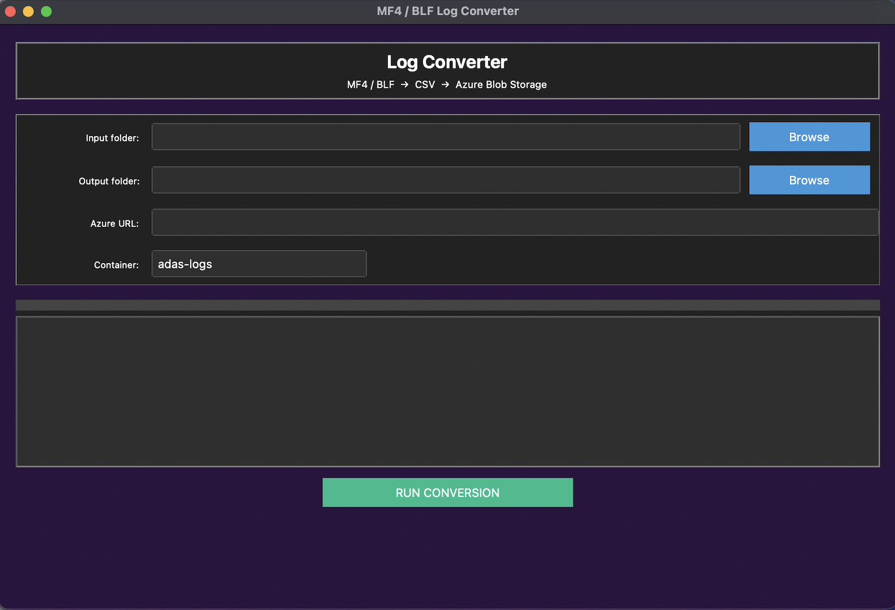

# MF4/BLF Parser GUI

Desktop GUI for converting automotive MF4 / BLF log files to CSV. Features Azure Blob Storage upload, dark theme, and batch processing.

  

## ✨ Features
- **MF4 → CSV**: `MDF().to_dataframe().to_csv()`
- **BLF → CSV**: CAN messages (ts, ID, DLC, data.hex())
- **Azure Upload**: `BlobServiceClient` + `DefaultAzureCredential`
- **Live Progress**: Striped progressbar + real-time log
- **Dark UI**: `ttkbootstrap darkly` theme

## 🎛️ How It Works
1. Browse **Input** folder (MF4/BLF files)
2. Browse **Output** folder (CSV destination)
3. Add **Azure URL** + **Container** (optional)
4. **RUN CONVERSION** → Watch magic happen!
